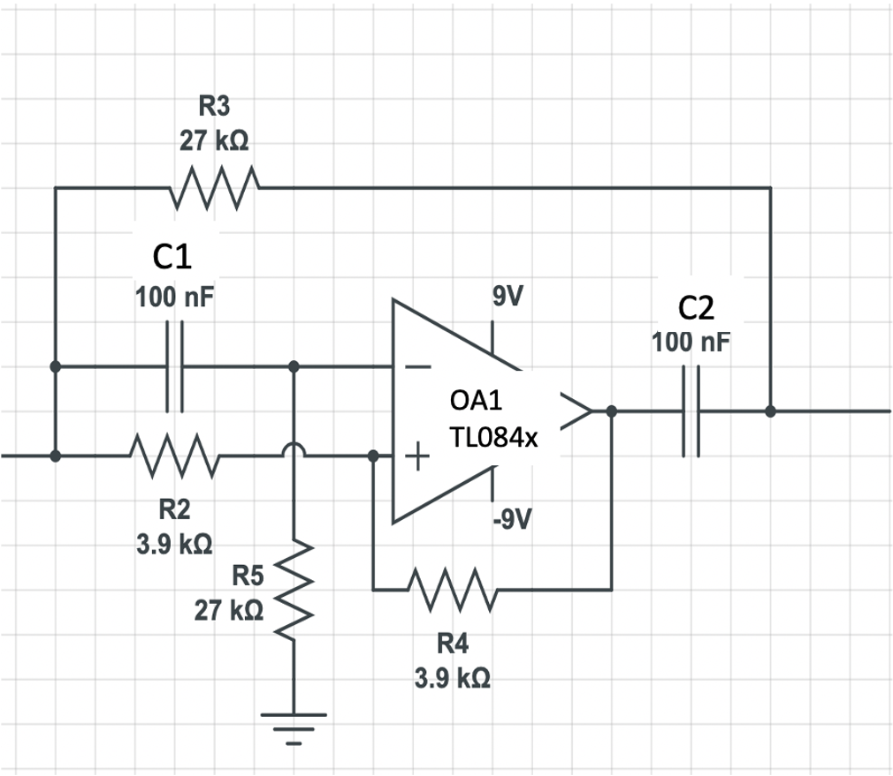
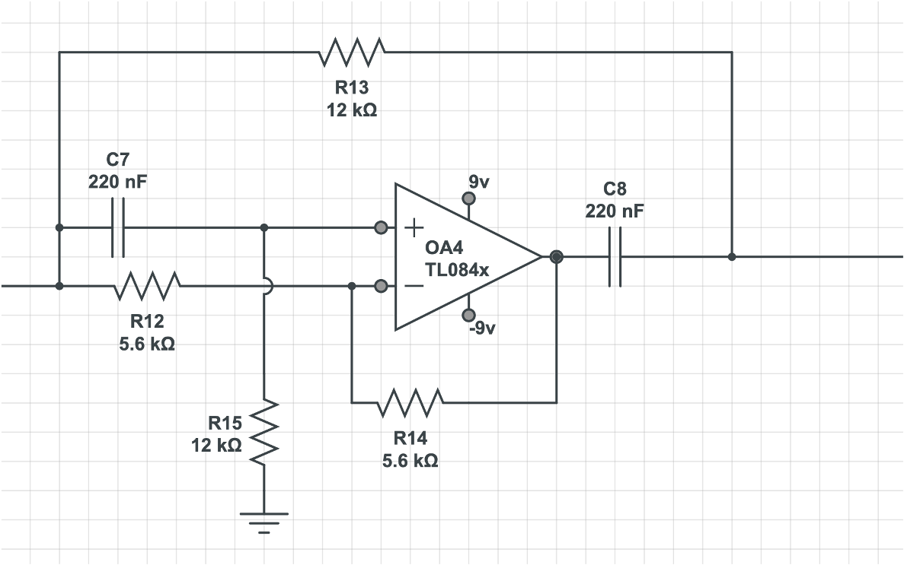

# EEG
This project builds an EEG headset which will allow the user to send morse code to a computer through their brain wave activity. It is a basic form of “mind reading” and has applications in helping paralyzed people who can not speak or write. The circuit amplifies electrical signals from the brain and uses various high and low pass analog filters. We then post-process the data using digital filters. We hope to demonstrate the successful communication of words in a timely manner through brainwave data. The biggest challenge is that an EEG which measures voltage differences across your scalp can produce noisy and sometimes unreliable signals, so careful filtering and project design must be done. Our general approach is to distinguish between two mental states with the EEG, whether a person is relaxed (alpha waves, 8-12Hz) or if they are concentrating / alert (beta waves, 12-30Hz). The user can then switch between these two mental states over time signaling a beep or no beep to communicate in morse code. We will use the following link as a starting point (found on instructables.com/DIY-EEG-and-ECG-Circuit/). 

# List of Components
* Raspberry Pi 4
* Bread board and wires
* Instrumental Amplifier AD622ANZ
* Quad Operational Amplifier TL084x
* Capacitors and Resistors
* Potentiometer CT6EW102-ND, 1kOhm
* Open Scope MZ
* TDE-2143-C EEG GOLD CUP ELECTRODES

# Eletrode Placement for Alpha Waves Measurements
There are many possible electrode placements depending on what wave one choose to measure. In our project, we measure alpha waves originating from the occipital lobe, because they are the strongest EEG signals. We need to use three electrode: one at the left mastoid (the bone at the back of the left ear) which is connected to the ground of the circuit; one located one inch above and one inch right of the nasion (the midline bony depression between the eyes where the frontal and two nasal bones meet); the last one located one inch above and one inch right of the inion (the projecting part of the occipital bone at the base of the skull). The 2nd and 3rd electrode placements are approximately in O2 and Fp2 regions in the below diagram:

The voltage difference oscillations between the 2nd and 3rd electrodes are the target alpha waves, which have a signature frequency in the range of 8-12 HZ.

# Circuit Design

The above picture is the final schematic. Note that the circuit ground is in fact 3.3V above the ADC ground to make sure the signal is always positive because the ADC chip cannot read negative voltage. The electrode behind the ear is connected to the circuit ground. The other two electrodes are fed into the first instrumental amplifier.

The circuit can be roughly divided into the following sections:
* Instrumental Amplifier (gain ~91)
* Notch Filter (60 HZ, gain = 1)
* High Pass Filter (Fc = 7.2 Hz)
* Low Pass Filter (Fc = 32.9 Hz)
* Instrumental Amplifier with variable gain (gain ~ 90-460)
* Notch Filter (60 HZ, gain = 1)

Individual Sections will be discussed further below.

## Instrumental Amplifier (gain ~91)

Alpha wave signals is 15-50 uV so we need a lot of amplification in the circuit. 
An instrumentation amplifier takes as its inputs 2 voltages, and outputs the difference between the two multiplied by some gain given by: G = 1 + (50.5 kOhm)/R, where R is the total resistance between pin 1 and 8. 

## Notch Filter (60 HZ, gain = 1)

The biggest source of noise in our system is centered at 60 Hz due to power line interference. This noise is present even though we use batteries to power the circuit. Thus we have 2 notch filters in the circuit. The notch frequency is given by f = 1/(2 PI R C) where R = R3 = R5. The other two resistor values are related to the quality factor of the filter, which determines how sharp the attenuation is.

## High Pass Filter (Fc = 7.2 Hz)

The high pass filter is mainly used to filter out galvanic skin response across our head. This will obscure the brain data we want, and as this interference is primarily low frequency. Here, we use a second order design. 

## Low Pass Filter (Fc = 32.9 Hz)

Another potential wave we could measure is the beta wave, which stops at 30 HZ. Thus, we are not interested in frequency > 30HZ and filter them out. 
We also use a second order design for the low pass filter.

## Instrumental Amplifier with variable gain (gain ~ 90-460)

Alpha wave amplitude varies from person to person, so we use the potentiometer to design an amplifier with variable gain. 

## Notch Filter (60 HZ, gain = 1)

Another 60 HZ is necessary at the end of the circuit since the power line interference likely sneaks into the circuit through prior steps. 

# Results
We built our circuit to measure Alpha waves which are from 8-12Hz. When relaxed the power of these waves should increase and when concentrating the power of these waves should decrease. To test relaxed state the user closes their eyes, to test concentrating the user opens their eyes and look at 'crazy' images.

### Lower Amplification Tests:

| Relaxed | Concentrating |
| --- | --- |
| 689 | 85 |
| 958 | 531 |
| 829 | 429 |
| 802 | 50 |
| 421 | 112 |

### Higher Amplification Tests:

| Relaxed | Concentrating |
| --- | --- |
| 5,294 | 23,384 |
| 4,848 | 36,822 |
| 5,077 | 39, 640 |
|11,051 | 55,365 |
| 5,748 | 32,897 |
